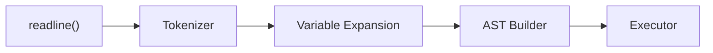

*This project has been created as part of the 42 curriculum by tshimizu, nkojima.*

# minishell

As beautiful as a shell.

## Description

Minishell is a simplified shell implementation written in C, inspired by bash. The goal of this project is to gain a deep understanding of how a Unix shell works under the hood — including process creation, file descriptor management, signal handling, and command parsing.

The shell reads user input interactively, tokenizes and parses it into an abstract syntax tree (AST), expands environment variables, and executes commands with support for pipes, redirections, and builtin commands.

## Features

### Parsing
- Tokenizer that splits input into words and operators
- Single quote handling (`'...'`) — prevents all metacharacter interpretation
- Double quote handling (`"..."`) — allows `$` expansion inside quotes
- Environment variable expansion (`$VAR`, `$?`)
- Token normalization (merging adjacent word tokens)

### Execution
- PATH-based command resolution
- Relative and absolute path execution
- Fork/exec pattern with proper exit status propagation
- Pipeline support via `|` connecting stdout to stdin across commands

### Redirections
- `<` — redirect input from file
- `>` — redirect output to file (truncate)
- `>>` — redirect output to file (append)
- `<<` — heredoc (read input until delimiter)

### Builtins
- `echo` with `-n` option
- `cd` with relative or absolute path
- `pwd`
- `export` (display and set environment variables)
- `unset`
- `env`
- `exit`

### Signal Handling
- `Ctrl-C` — displays a new prompt on a new line
- `Ctrl-D` — exits the shell
- `Ctrl-\` — ignored (no action)

## Architecture

### Processing Pipeline



The shell processes each line of input through the following stages:

1. **Input** — `readline()` reads a line from the user with prompt display and history support.
2. **Tokenization** — The input string is split into tokens (words, operators, quotes).
3. **Expansion** — Environment variables (`$VAR`) and the exit status (`$?`) are expanded.
4. **AST Construction** — Tokens are parsed into a binary tree with `NODE_CMD` and `NODE_PIPE` node types.
5. **Execution** — The AST is traversed recursively. Pipes create child processes connected via `pipe()`, builtins run in the current process, and external commands are resolved via PATH and executed with `execve()`.

### Source Structure

```
src/
├── input/          REPL loop, signal handlers
├── parse/
│   ├── lexical/    Tokenizer, variable expansion, quote handling
│   └── syntax/     AST construction from token stream
├── exec/           Command execution, pipes, redirections, heredoc
├── builtin/        Builtin command implementations
└── utils/          Helper functions, environment list management
```

## Instructions

### Prerequisites

- **readline library** — required for interactive input and history
  ```
  brew install readline
  ```

### Build

```bash
make          # standard build
make re       # clean rebuild
make valgrind # launch the shell with valgrind
```

### Run

```bash
./minishell   # launch the shell
```

### Clean

```bash
make clean    # remove object files
make fclean   # remove object files and executable
```

## Resources

- [name](url)

### AI Usage

AI tools were used throughout the project for the following purposes:

- **Learning & research** — Understanding bash specification details, POSIX shell semantics, and how specific edge cases should behave (e.g., quote handling rules, heredoc behavior, signal disposition in child processes).
- **Debugging & troubleshooting** — Identifying edge cases in tokenization and expansion
- **Test strategy & test cases** — Generating comprehensive edge-case scenarios for parsing, expansion, redirections, and builtin commands.
- **Documentation** — Assistance in writing this README.