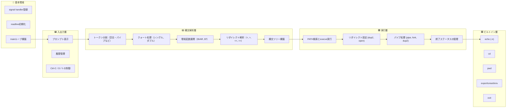
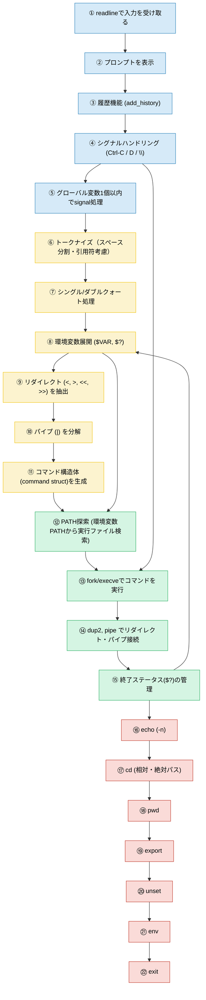

# MiniShell 実装ガイド

## 目次

1. [プロジェクト構成](#プロジェクト構成)
2. [段階的実装順序](#段階的実装順序)
2. [依存関係](#依存関係)
---

## プロジェクト構成

```
minishell
  docs
  libs
    libft
  tests
  includes
  src
    utils
    input
    parse
    exec
    builtin
  objs
  Makefile

```

---

## 段階的実装順序

---
# **📌 Milestone 1 — 基本の対話ループ（REPL）**

### **目標**

* minishell が起動し、プロンプトを表示し、入力できる
* `readline()` と `add_history()` が動く

### **実装**

* プロンプト表示
* `readline("minishell$ ")`
* EOF(ctrl-D) で終了
* 空行処理

### **動作確認**

```
minishell$ hello
minishell$
minishell$ <ctrl-D>
```

---

# **📌 Milestone 2 — シグナルが Bash と同じように動く**

### **目標**

* ctrl-C: 新しい行のプロンプトが出る
* ctrl-: 何も起きない
* ctrl-D: 終了

### **実装**

* `sigaction`
* `g_signal_status`（グローバルは1つだけ）

### **動作確認**

```
minishell$ <ctrl-C>
minishell$ (新しいプロンプト)
```

Bash と同じ動きをすること。

---

# **📌 Milestone 3 — 最小のパーサ（スペース区切りだけ）**

### **目標**

* 入力をスペースで分割してコマンド配列を作成
* 引用符などはまだなし

### **動作確認**

```
minishell$ ls -l /tmp
→ ["ls", "-l", "/tmp"]
```

実行はまだしない。

---

# **📌 Milestone 4 — PATH によるコマンド実行（最小）**

### **目標**

* fork + execve で実行できる
* PATH 探索あり

### **動作確認**

```
minishell$ ls
(結果が表示される)

minishell$ echo 問題なし
bash の echo は外部コマンドではないので失敗する→OK
※ echo builtin は後で実装する
```

---

# **📌 Milestone 5 — シングル/ダブルクォート実装**

### **目標**

* `'abc def'` → 1トークン
* `"a $PATH b"` → 展開あり
* `'a $PATH b'` → 展開なし

### **動作確認**

```
minishell$ echo "hello $USER"
minishell$ echo 'hello $USER'
```

---

# **📌 Milestone 6 — 環境変数展開（$VAR と $?）**

### **目標**

* `$PATH`, `$HOME`
* `$?`（直前の終了ステータス）

### **動作確認**

```
minishell$ ls
minishell$ echo $?
0

minishell$ cat unknown
minishell$ echo $?
1
```

---

# **📌 Milestone 7 — リダイレクト (<, >, >>, <<)**

### **最初にやる順番**

1. `>` 出力リダイレクト
2. `<` 入力リダイレクト
3. `>>` 追記
4. `<<` ヒアドキュメント（最難関）

### **動作確認**

```
minishell$ echo hello > a.txt
minishell$ cat < a.txt
hello

minishell$ echo test >> a.txt
minishell$ cat a.txt
hello
test

minishell$ cat << EOF
aaa
bbb
EOF
aaa
bbb
```

---

# **📌 Milestone 8 — パイプ（|）**

### **実装順**

1. パイプでコマンド列を分割
2. 各コマンドごとに fork
3. `pipe() + dup2()` で接続

### **動作確認**

```
minishell$ ls | wc -l
```

---

# **📌 Milestone 9 — ビルトイン（外部コマンドと区別が必要）**

順番は簡単なものから：

1. echo (-n)
2. pwd
3. env
4. cd
5. export
6. unset
7. exit（最終的な cleanup も）

### **動作確認**

```
minishell$ echo -n hello
hellominishell$
```

---

# **📌 Milestone 10 — 全体統合テスト**

### テスト項目例

#### ✔ quoting

```
echo "a b ' c"
```

#### ✔ pipe + redirect

```
ls -l | grep minishell > out.txt
```

#### ✔ builtin in pipeline

```
export X=123 | cat
```

#### ✔ signal while running command

```
sleep 5   ← ctrl-C
```

#### ✔ $? が更新される

```
ls not_exist
echo $?
```

---

### 依存関係



